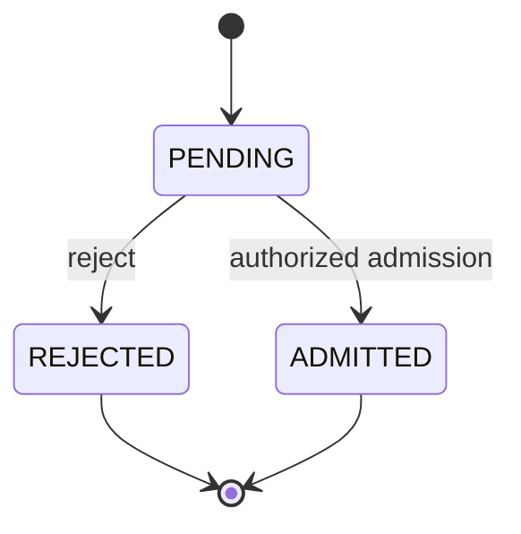
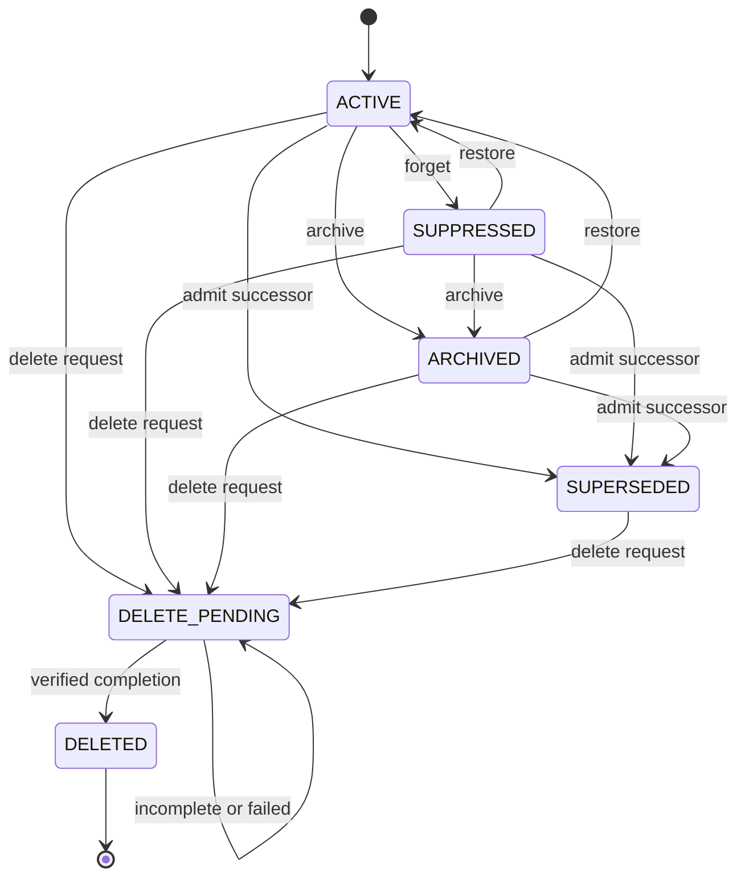

# Candidate Formal Memory Object Model v0.1

Status: draft candidate · Version 0.1

## Candidate status

This document proposes an abstract formal system, **FMO-0.1**, for describing memory-object identity, lifecycle, time, provenance, authority, epistemic assessment, conflict, and deletion. It is a falsifiable input to later formal analysis. It has not been shown consistent, satisfiable, complete, sound, realizable, secure, or useful.

FMO-0.1 does not select a serialization, database, index, model, embedding, API, process topology, hosting environment, or application schema. Its “objects” and “operations” are mathematical entities and relations, not implementation components.

The vocabulary is mapped to the companion [Candidate Memory Taxonomy v0.1](MEMORY_TAXONOMY_v0.1.md). If the natural-language taxonomy and this formalization disagree, neither silently overrides the other; the mismatch is an analysis input requiring versioned resolution.

## Research question

Can a typed transition system represent the proposed distinctions among memory candidates, immutable object versions, functional roles, lifecycle processes, temporal contexts, provenance, confidence, uncertainty, conflict, authority, and deletion while preserving explicit non-entailments and avoiding implementation assumptions?

## Interpretation boundary

FMO-0.1 models declared records and observable governance outcomes. It does not model subjective experience, biological processes, the truth of arbitrary natural-language claims, legal validity, moral legitimacy, or physical erasure outside a declared system boundary.

The symbols “content,” “claim,” “confidence,” “authorized,” “accessible,” and “deleted” have only the scoped meanings defined below. In particular, admission is not belief, retrieval is not recall success, a provenance graph is not authenticity, and deletion is not an unbounded statement about every possible copy in the world.

## Notation

- `x : X` means that element `x` has type `X`.
- `X ⇀ Y` is a partial function; `X → Y` is a total function.
- `P(X)` is the powerset of `X`; `Pfin(X)` is the set of finite subsets.
- `seq(X)` is a finite ordered sequence over `X`.
- `⊥` is unknown or undefined, not false.
- `I(T)` is the set of closed, open, or partially unknown intervals over time domain `T`.
- `t1 ≺ t2` means transaction event `t1` precedes `t2` in the declared logical order.
- A postcondition constrains a successful operation record. It does not promise that the operation will succeed.

## Type system

Every set is candidate structure subject to later satisfiability analysis.

| Symbol | Type | Candidate meaning |
| --- | --- | --- |
| `A` | nonempty set | Actors accountable for assertions, operations, requests, grants, or obligations. |
| `AD` | nonempty set | Authority domains in which actor and policy identities are resolved. |
| `AR` | finite set | Actor roles: `ORIGINATOR`, `SUBJECT`, `REQUESTER`, `CONTROLLER`, `OPERATOR`, `SYSTEM`, `SOURCE`, `AUDITOR`, `OTHER`. |
| `E` | set | Source events, including inputs, communications, observations, and system actions. |
| `N` | set | Memory candidates not yet admitted. |
| `O` | set | Exact admitted memory object versions. |
| `S` | set | Stable memory series identities. |
| `C` | set | Abstract content values or content references. Membership does not prescribe storage. |
| `K` | set | Claims that can be assessed or compared under an interpretation. |
| `P` | set | Versioned policy statements. |
| `PR` | set | Purposes for which an operation is requested. |
| `Q` | set | Query or task contexts. |
| `FR` | finite set | Functional roles: `EPISODIC`, `SEMANTIC`, `PROCEDURAL`, `PROSPECTIVE`, `WORKING`. |
| `U` | set | Immutable operation-event records. |
| `PT` | set | Reified provenance assertions. |
| `CA` | set | Confidence-assessment records. |
| `UA` | set | Uncertainty-description records. |
| `CX` | set | Claim-comparison contexts and interpretation identifiers. |
| `DS` | set | Deletion-scope declarations. |
| `B` | set | Declared governed system boundaries. |
| `T` | ordered set | Logical transaction times with deterministic tie breaking. |
| `ET` | set of intervals | Source-event time intervals, possibly partially unknown. |
| `VT` | set of intervals | Claim-validity intervals, possibly partially unknown. |
| `DIG` | set | Abstract immutable-content identifiers; no hashing method is selected. |

### Enumerated state and result domains

```text
CandidateState  = {PENDING, REJECTED, ADMITTED}
ObjectState     = {ACTIVE, SUPPRESSED, ARCHIVED, SUPERSEDED,
                   DELETE_PENDING, DELETED}
AuthzDecision   = {PERMIT, DENY, UNRESOLVED}
OperationResult = {SUCCEEDED, REJECTED, FAILED, HALTED, UNKNOWN}
TruthStatus     = {SUPPORTED, CHALLENGED, UNRESOLVED, WITHDRAWN}
DeletionResult  = {VERIFIED_WITHIN_SCOPE, INCOMPLETE, FAILED, UNVERIFIED}
```

`TruthStatus` is an assessment label, not a truth-value oracle. FMO-0.1 does not require every claim to have one.

## Core entities

### Source event

A source event is represented by:

```text
event : E → (event_id, source_actor_or_⊥, event_time_or_⊥,
             receipt_time, content_or_reference, authority_domain)
```

Two source events may contain byte-identical or semantically equivalent content and remain distinct because time, actor, consent, authority, or provenance differs.

### Memory candidate

A memory candidate is the immutable proposal tuple:

```text
candidate : N → (candidate_id, content_id, proposed_series_or_⊥,
                 origin_refs, transform_ref, created_by,
                 created_at, authority_domain, policy_refs)
```

with dynamic state derived from immutable operation events:

```text
candidateState : N × T → CandidateState
```

A rejected candidate is not an admitted memory object. An admission operation creates an `o : O`; it does not relabel `n` as the same typed entity.

### Exact memory object version

An admitted memory object version is represented by:

```text
object : O → (object_id, series_id, version_id, admitted_content_id,
              admitted_from_candidate, created_at, authority_domain,
              initial_policy_refs)
```

with partial projections:

```text
seriesOf       : O → S
versionOf      : O → DIG
contentID      : O → DIG
admittedFrom   : O → N
createdAt      : O → T
domainOf       : O → AD
objectState    : O × T → ObjectState
materialized   : O × B × T → {true, false, unknown}
accessible     : A × O × Q × PR × B × T → {true, false, unknown}
```

`contentID(o)` is an abstract historical identity used to express version immutability. It does not require that deleted content or a reversible digest be retained. `materialized` and `accessible` describe bounded present observability. Minimal audit residue, if retained, is a separate governed entity and must not contain or reconstruct the deleted content under the declared deletion scope.

### Series and succession

```text
predecessor : O ⇀ O
supersedes  ⊆ O × O
```

`supersedes(o_new, o_old)` is intended to mean:

```text
seriesOf(o_new) = seriesOf(o_old)
∧ predecessor(o_new) = o_old
∧ createdAt(o_old) ≺ createdAt(o_new)
```

It does not mean that the predecessor was false, deleted, inaccessible, or semantically equivalent to the successor.

### Claims and object content

```text
asserts       ⊆ O × K
about         ⊆ K × (A ∪ E ∪ O ∪ S)
validDuring   : K → VT
assessment    ⊆ A × K × CX × T × TruthStatus
```

Not every object asserts a claim; procedure-like, opaque, media, policy, or event-trace content may require other interpretation relations. The model does not assign truth values to arbitrary `K`.

## Time model

FMO-0.1 separates three time dimensions:

1. **Event time** — when a source occurrence is asserted to have happened; it may be an interval or unknown.
2. **Validity time** — when a claim is asserted to apply; it may be open-ended, disputed, or unknown.
3. **Transaction time** — when an immutable operation event entered the governed history.

Transaction order `≺` is a strict total order over operation events after deterministic tie breaking. Wall-clock synchronization is not assumed. Event time and validity time are not inferred from transaction time.

Candidate temporal constraints:

```text
createdAt(input) ≺ createdAt(derived_output)
createdAt(predecessor(o)) ≺ createdAt(o)
retrievalTime(r) ≺ createdAt(reconsolidated_candidate)
```

Clock error, late arrival, retroactive validity, and disputed time are represented as uncertainty; they must not be repaired silently by transaction order.

## Actors, roles, and authority

### Actor-role relation

```text
actorRole ⊆ A × AR × AD × I(T)
```

Roles are scoped and time-bounded. One actor may have multiple roles. No `AR` value itself grants an operation. In particular, `ORIGINATOR`, `SUBJECT`, `OPERATOR`, `SYSTEM`, and `SOURCE` are not synonyms for owner or unrestricted controller.

### Authority decision

Let `OpKind` contain the operation names defined below. Authorization is an abstract policy-evaluation function:

```text
authz : A × OpKind × (N ∪ O ∪ S ∪ DS) × PR × AD × T
        → AuthzDecision
```

State-changing success requires `PERMIT`. `DENY` and `UNRESOLVED` cannot produce a successful state-changing event.

FMO-0.1 does not prescribe policy precedence. Conflicting grants, denials, obligations, delegation, revocation, jurisdiction, or subject interests may force `UNRESOLVED`. A later policy calculus must define how an adjudicated `PERMIT` is obtained and must expose its authority basis.

### Policy attachment

```text
governs       ⊆ P × (N ∪ O ∪ S ∪ DS)
policyEffect  : P → {PERMIT, DENY, REQUIRE, CONSTRAIN}
policyDomain  : P → AD
effectiveFor  : P → I(T)
issuedBy      : P → A
```

A policy being attached does not establish that its issuer had legitimate authority or that the policy is enforceable. Those are separate assessments.

## Provenance model

Every provenance assertion is reified so it can itself carry attribution and challenge state:

```text
prov : PT → (relation_kind, subject, object, asserted_by,
             operation_or_⊥, transaction_time, authority_domain)
```

Candidate relation kinds include:

```text
WAS_ENCODED_FROM, WAS_DERIVED_FROM, USED_INPUT,
WAS_GENERATED_BY, WAS_ATTRIBUTED_TO, WAS_ADMITTED_FROM,
WAS_UPDATED_FROM, WAS_CONSOLIDATED_FROM,
WAS_ABSTRACTED_FROM, WAS_RECONSOLIDATED_FROM,
WAS_RETRIEVED_IN, WAS_SUPERSEDED_BY
```

Convenience relations derived from `PT` include:

```text
sourceOf       ⊆ E × (N ∪ O)
derivedFrom    ⊆ (N ∪ O) × (E ∪ O)
generatedBy    ⊆ (N ∪ O) × U
usedInput      ⊆ U × (E ∪ N ∪ O)
attributedTo   ⊆ U × A
```

The provenance trace of `x` is the reachability closure over its asserted source, derivation, operation, and actor edges:

```text
trace(x) = reachable provenance assertions and endpoints rooted at x
```

Candidate provenance constraints:

- every admitted `o` links to exactly one admitted candidate through `WAS_ADMITTED_FROM`;
- every transform output links to every declared input and its transform operation;
- each operation is attributed to at least one accountable actor or explicitly unresolved actor identity;
- object-to-object derivation edges follow strict transaction order; and
- consolidation cannot replace its contributor edges with only a self-authored summary edge.

`trace(x)` being nonempty, connected, signed, or internally consistent does not entail completeness, authenticity, truth, consent, or authority. Provenance-forgery assessment is intentionally separate.

## Functional roles

FMO-0.1 is neutral between the taxonomy's stable kind-first and contextual role-first organizations.

The contextual relation is:

```text
playsRole ⊆ O × FR × Q × A × PR × T
```

The competing stable-kind hypothesis adds the optional function:

```text
primaryKind : S → {EPISODIC, SEMANTIC, PROCEDURAL, PROSPECTIVE}
```

and the axiom that `primaryKind(s)` is single-valued and invariant for the lifetime of `s`. The role-first hypothesis rejects that axiom and permits many contextual roles without an identity or version change. FMO-0.1 does not choose between these extensions.

## Confidence and uncertainty

Confidence does not entail truth, correctness, or authority. It is an attributed, target-specific assessment whose interpretation depends on its declared method, scale, context, and time.

### Confidence assessment

```text
confidence : CA → (target, assessor, method, scale,
                   value_or_interval, context, transaction_time)
```

where `target` may be a claim, source, provenance assertion, role classification, retrieval result, conflict result, or operation outcome. `scale` defines the meaning and ordering, if any, of values. Two assessments are comparable only when an explicit mapping establishes compatible targets, scales, contexts, and methods.

For a declared numeric unit interval scale:

```text
numericValue(ca) = [lower, upper], 0 ≤ lower ≤ upper ≤ 1
```

No calibration, probabilistic interpretation, or accuracy follows from this interval.

### Uncertainty description

```text
uncertainty : UA → (target, assessor_or_method, uncertainty_kind,
                    alternatives_or_bounds, context, transaction_time)
```

Candidate uncertainty kinds include `MISSING_INFORMATION`, `AMBIGUITY`, `IMPRECISION`, `VARIABILITY`, `MODEL_LIMIT`, `IDENTITY_UNCERTAINTY`, `TEMPORAL_UNCERTAINTY`, `PROVENANCE_UNCERTAINTY`, and `POLICY_UNCERTAINTY`.

Confidence and uncertainty are not complements. A high confidence assessment about source identity can coexist with high uncertainty about claim validity. No operation may silently collapse multiple assessments or uncertainty kinds into one value without recording a versioned aggregation rule and its inputs.

## Conflict model

```text
conflicts ⊆ K × K × CX × T
```

For inter-claim conflict, the candidate relation is symmetric and irreflexive:

```text
conflicts(k1, k2, cx, t) ⇒ k1 ≠ k2
conflicts(k1, k2, cx, t) ⇔ conflicts(k2, k1, cx, t)
```

A conflict assertion also requires overlapping or unresolved validity intervals and a named incompatibility rule under `cx`. Non-overlap is not conflict merely because claim strings differ. Unknown compatibility is not non-conflict.

Internal inconsistency within one compound claim is modeled by a separate assessment, not `conflicts(k, k, ...)`. Detecting a conflict does not select a winner, retract a claim, alter confidence, supersede an object, or authorize belief revision.

## Lifecycle

The candidate lifecycle separates proposal decisions from admitted-object availability. Candidate states answer whether a proposal was accepted; object states answer how an exact admitted version may ordinarily participate after acceptance. Neither state family encodes truth, confidence, relevance, source authenticity, or functional role.

The following state distinctions are explicit:

- `PENDING` candidates await a governed admission decision; `REJECTED` candidates never become admitted objects.
- `ACTIVE` objects are eligible for context-specific access, although policy may still deny a particular request.
- `SUPPRESSED` objects have reduced ordinary availability but retain the possibility of authorized restoration.
- `ARCHIVED` objects retain a declared recovery path under different access conditions.
- `SUPERSEDED` objects preserve exact history after a successor is admitted; supersession is not erasure.
- `DELETE_PENDING` records an incomplete deletion attempt or request, while `DELETED` requires scoped verification and is terminal.

Every arrow below denotes a permitted state-transition shape, not an automatic or authorized transition. A successful immutable operation event, exact authority decision, policy basis, transaction time, and transition-specific postconditions are still required. A failed, halted, rejected, or unresolved operation creates history but does not take the success transition.

### Candidate lifecycle



Candidate states are terminal after `REJECTED` or `ADMITTED`. A changed proposal receives a new candidate identity.

### Object lifecycle



The diagram is a proposed transition relation, not evidence that a system enforces it. `SUPPRESSED` represents the bounded forgetting distinction; `ARCHIVED` retains a recovery path; `SUPERSEDED` preserves historical identity; and `DELETED` is terminal for that exact object version.

## Operations

Every operation creates one immutable `u : U` with:

```text
operation : U → (operation_id, operation_kind, actor,
                 authority_decision, authority_basis,
                 inputs, outputs, purpose, transaction_time,
                 result, policy_refs, provenance_effects,
                 failure_or_⊥)
```

### Operation contracts

| Operation and candidate signature | Preconditions for success | Required postconditions on success | Explicit non-entailments |
| --- | --- | --- | --- |
| `encode(e, transform, a, pr, t) → n` | `e : E`; actor and transform identified; applicable handling is `PERMIT`. | New `n : N` in `PENDING`; immutable content identity; source, transform, actor, and time provenance. | Encoded does not mean admitted, true, relevant, safe, or durable. |
| `admit(n, a, pr, t) → o or rejection` | `candidateState(n,t)=PENDING`; exact policies evaluated; state-changing acceptance requires `PERMIT`. | Acceptance creates fresh `o : O` in `ACTIVE`, exact series/version identity, and `WAS_ADMITTED_FROM`; rejection records reason and sets candidate `REJECTED`. | Admission does not mean belief, truth, importance, consent for other purposes, or permanent retention. |
| `retrieve(q, a, pr, b, t) → seq(O)` | Query/task, actor, purpose, boundary, eligibility policy, and time declared. | Every returned object is in an allowed retrievable state and `accessible=true` for that context; zero or more results and decision metadata recorded. | A result need not be true, relevant, used, topically unique, or complete. Empty result does not mean absence. Retrieval does not automatically update or reconsolidate. |
| `update(o, delta, a, pr, t) → n` | Exact predecessor exists and is not `DELETED`; delta and actor identified; `PERMIT`. | Fresh pending candidate; proposed same series; changed content or metadata identity; `WAS_UPDATED_FROM`; predecessor remains unchanged until successor admission, then becomes `SUPERSEDED`. | Update does not erase, correct, or discredit the predecessor. |
| `consolidate(I, transform, a, pr, t) → n`, `I ∈ Pfin(O)`, `|I| ≥ 2` | Every input exact and eligible; transform and actor identified; `PERMIT`. | Fresh pending candidate; `WAS_CONSOLIDATED_FROM` edge for every input; omissions and uncertainty effects declared. | Consolidation does not imply truth, losslessness, improved retrieval, source deletion, or new series continuity. |
| `abstract(I, rule, a, pr, t) → n` | Nonempty exact inputs; declared abstraction rule and particulars intended to be omitted; `PERMIT`. | Fresh pending candidate; all input lineage; omitted-feature declaration; uncertainty and scope effects recorded. | Abstraction does not imply correct generalization, compression, or semantic equivalence. |
| `reconsolidate(o, r, context, a, pr, t) → n` | Recorded retrieval/reactivation event `r` used exact `o`; `time(r) ≺ t`; new context and change declared; `PERMIT`. | Fresh pending candidate; lineage to `o`, `r`, and new context; proposed same or explicitly new series. | Retrieval alone does not cause reconsolidation; reconsolidation does not inherit trust or authority from the predecessor. |
| `deduplicate(I, criterion, a, pr, t) → equivalence assessment` | At least two exact items; versioned comparison criterion; actor and policy declared. | Pairwise or set-level outcome, confidence, uncertainty, and disposition recorded; no implicit state transition. | Equivalence does not imply identical provenance, authority, retention, merger, or deletion. |
| `detectConflict(k1, k2, cx, a, t) → assessment` | Distinct claims, named interpretation and incompatibility rule, temporal relation evaluated. | Symmetric result plus basis, confidence, uncertainty, and inputs recorded. | Conflict does not identify truth, retract content, revise belief, or grant mutation authority. |
| `forget(o, a, pr, t) → state event` | `o` is `ACTIVE`; availability-reduction rule declared; `PERMIT`. | `o` becomes `SUPPRESSED`; prior version identity and content identity unchanged; resulting access scope recorded. | Forgetting does not imply archival, deletion, physical erasure, irrecoverability, or confidence reduction. |
| `archive(o, a, pr, t) → state event` | `o` is `ACTIVE` or `SUPPRESSED`; archive and recovery policies declared; `PERMIT`. | `o` becomes `ARCHIVED`; retained-materialization and recovery conditions recorded. | Archival does not imply deletion, ordinary availability, permanent durability, or truth. |
| `restore(o, a, pr, t) → state event` | `o` is `SUPPRESSED` or `ARCHIVED`; recovery path exists; `PERMIT`. | `o` becomes `ACTIVE`; restoration provenance and policy recorded. | Restoration does not create a new version unless content or governed metadata changes. |
| `requestDelete(root, ds, a, pr, t) → deletion event` | Exact root and `ds : DS`; request actor and authority basis declared; policy result is `PERMIT` or explicitly `UNRESOLVED` for a non-executing pending request. | A permitted request moves eligible targets to `DELETE_PENDING`; target closure, boundary, exceptions, and verification plan frozen for this attempt. | A request is not deletion success. Pending state does not imply bytes are absent. |
| `executeDelete(ds, a, pr, t) → DeletionResult` | Targets, boundary, exceptions, retention conflicts, and verification method declared; execution requires `PERMIT`. | `VERIFIED_WITHIN_SCOPE` moves every non-excepted target to `DELETED` and satisfies the scoped postcondition below; other results preserve incomplete status and failure detail. | Local index removal, suppression, expiry, or unknown target status does not imply verified deletion. |

Transform operations yield candidates so admission remains a separate governance decision. A later analysis may reject this separation, but it cannot silently combine transformation and admission while claiming conformance to FMO-0.1.

## Deletion scope and postcondition

A deletion scope is:

```text
scope : DS → (root_targets, boundary, closure_rule, relation_snapshot,
              replicas_considered, backups_considered,
              reconstruction_dependencies, exceptions,
              audit_residue_rule, verification_method, authority_basis)
```

For attempt `d : DS`, define:

```text
Targets(d) = Closure(root_targets(d), closure_rule(d), relation_snapshot(d))
             minus exceptions(d)
```

The closure may include exact versions, successors, derivatives, consolidated or abstracted outputs, caches, indexes, replicas, backups, and governed reconstruction dependencies. The scope must say which relations are included; FMO-0.1 does not assume that all copies are discoverable.

Candidate success postcondition at completion time `td`:

```text
DeletionSuccess(d, td) ⇒
  ∀x ∈ Targets(d), ∀t ≥ td:
      objectState(x, t) = DELETED
      ∧ materialized(x, boundary(d), t) = false
      ∧ no governed operation within boundary(d) can reconstruct
        contentID(x) from state whose lineage depends on x
```

This postcondition is conditional on the correctness and completeness of the declared relation snapshot, closure rule, boundary, and verifier. It does not cover unknown or external copies unless they are explicitly inside the boundary. A later independently sourced object with equivalent content is a new identity and does not resurrect the deleted object, although policy may still require a new deletion decision.

An audit tombstone may record non-content facts such as operation ID, target identity, scope version, authority basis, outcome, and time only if the policy permits. It must not retain the target content or make it reconstructable within the declared scope. Whether even minimal metadata leaks sensitive facts is an open security obligation.

## Candidate invariants

These invariants are propositions to test, not established properties.

| Invariant | Candidate constraint |
| --- | --- |
| `FMO-INV-01` | Keep source events, candidates, admitted versions, operations, provenance, assessments, policies, and deletion scopes type-distinct. |
| `FMO-INV-02` | Make each exact object/version identity unique. |
| `FMO-INV-03` | Preserve identity-bearing fields of an admitted exact version. |
| `FMO-INV-04` | Permit only lifecycle transitions justified by one successful immutable event. |
| `FMO-INV-05` | Require exact operation-scoped authority for every successful state change. |
| `FMO-INV-06` | Preserve admission and transformation provenance with attribution. |
| `FMO-INV-07` | Make object derivation follow strict transaction order. |
| `FMO-INV-08` | Preserve predecessors when a successor is admitted. |
| `FMO-INV-09` | Keep admission epistemically neutral. |
| `FMO-INV-10` | Keep retrieval epistemically and mutationally neutral. |
| `FMO-INV-11` | Scope every confidence and uncertainty assessment. |
| `FMO-INV-12` | Preserve both sides and their state when conflict is detected. |
| `FMO-INV-13` | Evaluate access for an exact actor, query, purpose, boundary, and time. |
| `FMO-INV-14` | Require the deletion postcondition over the complete declared target closure. |
| `FMO-INV-15` | Prevent a deleted exact identity from returning to an accessible state. |
| `FMO-INV-16` | Retain failed, rejected, halted, incomplete, and unresolved operation history. |

### FMO-INV-01 — Type separation

`E`, `N`, `O`, `U`, `PT`, `CA`, `UA`, `P`, and `DS` have distinct typed identities. Admission creates an `O` from an `N`; it does not make one entity inhabit both types.

### FMO-INV-02 — Exact identity uniqueness

No two object versions share the same `(object_id, version_id)` pair, and every `version_id` identifies one immutable admitted content identity.

### FMO-INV-03 — Version immutability

For any `o : O`, `seriesOf(o)`, `versionOf(o)`, `contentID(o)`, `admittedFrom(o)`, and `createdAt(o)` do not change. Later metadata or content changes create a new candidate and, if admitted, a new exact object version.

### FMO-INV-04 — Legal lifecycle transitions

Every object-state change is justified by exactly one successful immutable operation event and belongs to the declared lifecycle transition relation. `DELETED` has no outgoing transition.

### FMO-INV-05 — Authority guard

Every successful state-changing operation has `authz(...)=PERMIT` for its exact actor, operation, target, purpose, authority domain, and time. `DENY` and `UNRESOLVED` cannot yield state-changing success.

### FMO-INV-06 — Provenance presence and attribution

Every admitted object traces to one admitted candidate and its admission event. Every transformation output traces to its exact inputs, transform operation, actor or explicitly unresolved actor identity, and transaction time.

### FMO-INV-07 — Derivation acyclicity

If an object or candidate derives from an object, the input object's creation precedes the output's creation. Therefore object-to-object derivation is intended to be acyclic under the strict transaction order.

### FMO-INV-08 — Supersession preservation

Admitting a successor changes an eligible predecessor to `SUPERSEDED` but does not mutate its exact identity, content identity, provenance, assessments, or prior operation history.

### FMO-INV-09 — Admission neutrality

Admission adds no truth, support, relevance, confidence, consent-for-other-purpose, or biological-memory predicate.

### FMO-INV-10 — Retrieval neutrality

Retrieval adds no truth, support, use, relevance, completeness, update, consolidation, or reconsolidation predicate unless a separate operation explicitly records it.

### FMO-INV-11 — Scoped epistemic assessments

Every confidence or uncertainty record names its target, assessor or method, context, and time. Aggregation creates a new assessment with recorded rule and inputs; it never overwrites contributors.

### FMO-INV-12 — Conflict preservation

Conflict detection records an assessment without changing either claim, carrier object, confidence assessment, lifecycle state, or authority relation.

### FMO-INV-13 — Contextual access

`accessible` is evaluated for exact actor, object, query, purpose, boundary, and time. Accessibility for one tuple does not imply accessibility for another actor or purpose.

### FMO-INV-14 — Deletion closure

A `VERIFIED_WITHIN_SCOPE` result requires the deletion postcondition for every non-excepted target in the frozen scope. A missing, unknown, accessible, or reconstructable target prevents that result.

### FMO-INV-15 — No resurrection under one identity

Once `objectState(o,t)=DELETED`, no later time assigns another state to `o`, and no new object may reuse the same exact `(object_id, version_id)`.

### FMO-INV-16 — Failure retention

Rejected, failed, halted, incomplete, and unresolved operation results remain immutable operation events. A later successful attempt does not erase them.

## Propositions and conjectures

No proposition below has been proved in this artifact.

### FMO-P01 — Derivation acyclicity proposition

**Statement to prove:** If every object-to-object derivation edge strictly increases transaction time and `≺` is irreflexive and transitive, the object derivation graph contains no directed cycle.

**Proof sketch only:** A finite directed cycle would imply `t0 ≺ t1 ≺ ... ≺ t0`, contradicting irreflexivity. Obligations remain for partially ordered or simultaneous distributed events, candidates, imported lineage, and the exact graph domain.

### FMO-P02 — Historical-version preservation proposition

**Statement to prove:** Under FMO-INV-02, FMO-INV-03, FMO-INV-04, and FMO-INV-08, admission of a successor cannot alter the predecessor's identity-bearing fields or prior event history.

**Missing step:** The event-derived state semantics and field immutability need encoding in a verification formalism; natural-language declarations are insufficient.

### FMO-P03 — No-resurrection safety proposition

**Statement to prove:** Given terminal `DELETED`, unique exact identities, and operation authorization, no legal operation trace makes the same exact object accessible after verified deletion.

**Missing step:** “Accessible” and reconstruction channels must be fully axiomatized, including caches, audit residue, backups, and rollback/replay.

### FMO-P04 — Transformation-trace proposition

**Statement to prove:** If every transform operation adds a provenance edge for every exact input and provenance events are immutable, every admitted transformed object has a path to all declared direct inputs.

**Limit:** This establishes neither undeclared-input completeness nor provenance authenticity.

### FMO-C01 — Finite deletion-closure conjecture

**Conjecture:** For a finite, closed governed boundary with complete derivation and replica relations, `Targets(d)` can be enumerated and the deletion postcondition can be checked.

**Potential counterexample:** dynamically generated reconstruction paths or an unbounded backup lineage may make closure non-finite or non-observable.

### FMO-C02 — Authority composition conjecture

**Conjecture:** Operation-scoped grants, denials, obligations, delegation, and revocation can be composed into `PERMIT`, `DENY`, or `UNRESOLVED` without granting an actor implicit universal authority.

**Potential counterexample:** two incomparable authority domains may require a fourth result such as `CONTESTED` or external adjudication rather than `UNRESOLVED`.

### FMO-C03 — Conflict separability conjecture

**Conjecture:** A bounded interpretation language can distinguish contradiction, temporal succession, uncertainty, and mere difference for the case set used in a future formal study.

**Potential counterexample:** claims whose meaning depends on unstated context may not admit a stable comparison relation.

### FMO-C04 — Taxonomy-organization neutrality conjecture

**Conjecture:** FMO-0.1 can host both the stable-kind and contextual-role organizations as conservative extensions without embedding either in the core lifecycle or governance axioms.

**Potential counterexample:** a lifecycle or identity invariant may implicitly assume that function is intrinsic or, conversely, context-relative.

## Intended entailments

These are proof targets for a future frozen formal analysis.

1. `supersedes(o2,o1)` entails same series, exact predecessor linkage, and later creation time.
2. A successful admitted update entails a fresh exact version and preservation of its predecessor.
3. A consolidation output entails declared lineage to every exact input supplied to that operation.
4. A reconsolidation output entails a prior retrieval/reactivation event plus new context.
5. A successful state-changing event entails an exact `PERMIT` authorization decision.
6. `ARCHIVED` entails retained materialization under a declared recovery policy, not ordinary accessibility.
7. `DELETED` after `VERIFIED_WITHIN_SCOPE` entails terminal state and the scoped non-materialization/non-reconstruction postcondition.
8. Every confidence assessment entails an assessor or method, target, scale, context, and time.
9. Every inter-claim conflict entails distinct claims, named comparison context, and overlapping or unresolved validity.
10. A failed or incomplete deletion attempt entails preservation of its failure event and forbids a verified-success label for that attempt.

## Explicit non-entailments

FMO-0.1 is intended to admit countermodels for every implication below:

- `encoded(x) ⇏ admitted(x)`
- `admitted(o) ⇏ true(content(o))`
- `admitted(o) ⇏ important(o)`
- `retrieved(o,q) ⇏ relevant(o,q)`
- `retrieved(o,q) ⇏ used(o,q)`
- `retrieved(o,q) ⇏ true(content(o))`
- `notRetrieved(o,q) ⇏ absent(o)`
- `highConfidence(k) ⇏ correct(k)`
- `lowConfidence(k) ⇏ false(k)`
- `hasProvenance(o) ⇏ authenticProvenance(o)`
- `sourceAuthorizedForWrite(a) ⇏ sourceTruthful(a)`
- `conflicts(k1,k2) ⇏ preferred(k1)` and `⇏ preferred(k2)`
- `supersedes(o2,o1) ⇏ deleted(o1)`
- `consolidated(o) ⇏ lossless(o)`
- `consolidated(o) ⇏ sourcesDeleted(o)`
- `forgotten(o) ⇏ deleted(o)`
- `archived(o) ⇏ inaccessibleToEveryActor(o)`
- `deleteRequested(o) ⇏ deletionSucceeded(o)`
- `locallyErased(o) ⇏ deletionVerifiedWithinScope(o)`
- `sameContentID(o1,o2) ⇏ sameAuthority(o1,o2)`
- `sameContentID(o1,o2) ⇏ sameDeletionDuty(o1,o2)`
- `actorRole(a,SYSTEM) ⇏ universalAuthority(a)`
- `playsRole(o,r,q1,t1) ⇏ playsRole(o,r,q2,t2)`
- `eventTime(e)=t ⇏ transactionTime(e)=t`

`⇏` denotes an intended non-entailment to verify, not a completed countermodel proof.

## Candidate countermodels

These small structures are proposed witnesses for later machine checking. They have not been checked against a formal encoding.

| Countermodel | Intended witness |
| --- | --- |
| `CM-01` | High confidence does not establish correctness. |
| `CM-02` | Retrieval establishes neither use nor relevance. |
| `CM-03` | A connected provenance trace need not be authentic. |
| `CM-04` | Forgetting need not be deletion. |
| `CM-05` | Different claims need not conflict across disjoint validity intervals. |
| `CM-06` | Local erasure need not satisfy a scoped deletion closure. |
| `CM-07` | Identical content need not carry identical governance. |
| `CM-08` | An actor role need not confer operation authority. |
| `CM-09` | A contextual role may change without an object-version change. |
| `CM-10` | Independent reacquisition need not resurrect a deleted identity. |

### CM-01 — High confidence, challenged claim

Let one admitted object `o` assert `k`. Let assessor `a` record confidence interval `[0.99,1.00]` for support at `t1`; let another assessment mark `k` `CHALLENGED` at `t2`. No axiom equates confidence with truth or removes either assessment. This is intended to witness `highConfidence(k) ⇏ correct(k)`.

### CM-02 — Retrieved but unused and irrelevant

Let `retrieve(q,a,pr,b,t)` return `[o1,o2]`; let a separate use event cite only `o1`, and a relevance assessment challenge `o2`. Both returned objects were eligible and accessible. This is intended to witness that retrieval implies neither use nor relevance.

### CM-03 — Connected but forged provenance

Let `o` have a connected trace from source event `e` through encoding and admission, while the provenance assertion naming `e` is assessed `CHALLENGED` for forgery. The trace remains structurally connected. This is intended to witness `hasProvenance(o) ⇏ authenticProvenance(o)`.

### CM-04 — Forgotten but recoverable

Let `o` transition `ACTIVE → SUPPRESSED` under an authorized forgetting event. Ordinary retrieval for purpose `p1` is false, while a separately authorized restoration operation remains available. This is intended to witness `forgotten(o) ⇏ deleted(o)`.

### CM-05 — Different claims without conflict

Let `k1` assert a location during validity interval `[t0,t1]` and `k2` assert a different location during `[t2,t3]`, with `t1 ≺ t2`. The claims differ, but the intervals do not overlap, so no inter-claim conflict is required. This stresses temporal comparison.

### CM-06 — Local erasure with surviving derivative

Let root `o1` be removed from one active materialization while consolidated derivative `o2` remains accessible and lies in the declared closure. `executeDelete` must return `INCOMPLETE`, not `VERIFIED_WITHIN_SCOPE`. This is intended to witness `locallyErased(o1) ⇏ deletionVerifiedWithinScope(o1)`.

### CM-07 — Same content, different governance

Let `o1` and `o2` share a content identity but derive from different sources and authority domains. `o1` has a deletion obligation; `o2` has a contested retention rule. Deduplication may relate them but cannot merge their authority or disposition. This stresses governance-preserving identity.

### CM-08 — Actor role without authority

Let actor `a` have role `OPERATOR` in domain `d`, but let `authz(a,executeDelete,o,pr,d,t)=DENY`. A delete attempt is recorded `REJECTED` and the state does not change. This is intended to witness that actor role does not entail universal authority.

### CM-09 — Contextual role change without object change

Under the role-first extension, let exact `o` play `PROSPECTIVE` for query `q1` at `t1` and `EPISODIC` for `q2` at `t2`, with no content, version, or lifecycle change. This structure is permitted by the core model but forbidden as a single primary-kind change by the stable-kind extension. It is a discriminator between competing taxonomy organizations.

### CM-10 — New independent source after deletion

Let `o1` reach verified `DELETED`. Later, independent event `e2` yields candidate `n2` and admitted `o2` with equivalent content but a new exact identity and provenance. `o1` remains terminal. This distinguishes independent reacquisition from resurrection while leaving repeated-deletion policy unresolved.

## Security and privacy properties to test

FMO-0.1 names structures needed to state these threats but does not mitigate them:

| Threat | Formal surface | Candidate falsification question |
| --- | --- | --- |
| Memory poisoning | source events, encoding, admission, provenance, confidence | Can untrusted input acquire trusted status or authority through admission alone? |
| Persistent prompt injection | content, procedural role, retrieval, authority | Can retrieved content cause an undeclared operation without an authorization event? |
| Cross-authority leakage | `accessible`, authority domain, purpose | Does access for one tuple imply access for another actor or purpose? |
| Provenance forgery | reified provenance assertions and assessments | Can a connected trace remain challengeable and non-authentic? |
| Retrieval manipulation | query context, eligibility, result sequence | Can result provenance and policy decisions be audited without treating ranking as truth? |
| Malicious consolidation | contributor edges, omissions, uncertainty | Can a derived object hide a contributor or inherit unsupported authority? |
| Identity or preference hijacking | series, actor, subject, authority, update | Can an actor change a series without exact operation-scoped permission? |
| Deletion failure | target closure, materialization, reconstruction, result | Does any surviving in-scope target prevent verified success? |
| Audit leakage | tombstone and deletion scope | Can retained audit facts reveal deleted sensitive content or event existence? |
| Rollback or replay | transaction order, immutable operations, terminal deletion | Can prior state be replayed to make a deleted exact version accessible? |

## Missing proof and definition obligations

1. **Satisfiability:** construct at least one nontrivial model satisfying all candidate invariants and lifecycle rules.
2. **Invariant independence:** determine whether any invariant is redundant or contradicts another.
3. **Transition completeness:** decide whether quarantine, expiry, legal hold, migration, corruption, and recovery need states or orthogonal relations.
4. **Distributed time:** replace or justify strict total transaction order when operations are concurrent or imported.
5. **Semantic continuity:** define when an admitted update remains in one series and when it must create a new series.
6. **Content identity:** define equality and equivalence without selecting a representation or leaking deleted content.
7. **Provenance completeness:** state which direct and indirect inputs transformations must declare and how omissions are detected.
8. **Provenance authenticity:** define trust evidence without confusing signatures, custody, or source authority with truth.
9. **Policy calculus:** specify delegation, revocation, denial, obligation, jurisdiction, purpose limitation, and contested authority.
10. **Authority liveness:** determine whether conservative `UNRESOLVED` can indefinitely block legitimate safety or deletion operations.
11. **Access noninterference:** formalize that unauthorized actors cannot infer content through results, errors, timing, scores, tombstones, or aggregate metadata.
12. **Confidence semantics:** define scale compatibility, calibration claims, assessor dependence, and aggregation constraints.
13. **Uncertainty algebra:** determine which uncertainty kinds may be combined and which must remain incomparable.
14. **Conflict semantics:** provide a bounded interpretation language and distinguish contradiction, inconsistency, temporal change, ambiguity, and difference.
15. **Revision semantics:** if later added, prove that conflict resolution does not erase contrary evidence or bypass authority.
16. **Role semantics:** formalize necessary and sufficient conditions for each functional role under both competing organizations.
17. **Deletion closure:** establish when closure is finite, discoverable, and stable during execution.
18. **Deletion verification:** define an observation model and adversary for “not materialized” and “not reconstructable.”
19. **External copies:** define how partial authority and unreachable systems constrain the wording of deletion outcomes.
20. **Audit residue:** formalize minimum records needed for accountability and maximum leakage compatible with the deletion scope.
21. **No resurrection:** model rollback, restore, replication lag, replay, and later independent reacquisition.
22. **Failure atomicity:** determine how partial transforms or deletion failures affect lifecycle and provenance.
23. **Countermodel validity:** machine-check CM-01 through CM-10 against an exact formal encoding.
24. **Biological independence:** verify that no axiom depends on an unstated biological equivalence assumption.
25. **Implementation independence:** verify that each primitive admits multiple storage, retrieval, and model realizations or no realization without changing its meaning.

## Non-goals

FMO-0.1 does not attempt to:

- choose a memory taxonomy organization;
- define an intelligence, consciousness, identity, or personhood theory;
- reproduce biological memory or claim biological plausibility;
- decide whether an arbitrary natural-language claim is true;
- assign one global importance, confidence, trust, or authority score;
- prescribe ranking, similarity, embeddings, storage, serialization, or model behavior;
- guarantee deletion outside a declared boundary;
- resolve law, consent, ownership, or jurisdiction;
- prove that memory improves task performance;
- provide production security, privacy, reliability, scalability, or readiness; or
- serve as an implementation specification for a full memory service.

## Rejection criteria

Reject, narrow, or supersede FMO-0.1 if governed formal analysis shows any of the following:

- no nontrivial structure can satisfy the core types, operation contracts, lifecycle, and invariants together;
- an intended non-entailment is entailed by the core axioms;
- an intended entailment has a well-typed countermodel under the declared assumptions;
- derivation cycles remain legal despite the strict-time premise;
- a state-changing operation can succeed under `DENY` or `UNRESOLVED`;
- admission, retrieval, confidence, provenance, or conflict implicitly creates truth or preference;
- exact historical versions can mutate or disappear through supersession;
- deletion success can be recorded while any non-excepted in-scope target remains materialized or reconstructable;
- a deleted exact identity can re-enter an accessible state;
- a required concept can be represented only by embedding a storage, vendor, model, application, or product assumption;
- the core model silently selects one competing functional taxonomy organization; or
- formal verification cannot distinguish syntax conformance from semantic validity.

## Known limitations

- FMO-0.1 is natural-language mathematics and has no machine-checked encoding.
- No satisfiability, independence, entailment, non-entailment, or countermodel result is asserted.
- The total transaction order is a simplifying candidate assumption that may not fit distributed histories.
- Natural-language content and claim interpretation are largely abstracted away.
- The authority function hides unresolved policy and jurisdiction complexity.
- Deletion depends on declared boundary and lineage completeness that may be unavailable.
- Accessibility and reconstruction lack an explicit adversary and observation model.
- The model does not quantify compute, storage, latency, or information leakage.
- Confidence and uncertainty are typed records without an accepted calculus.
- The lifecycle may mix states with independent dimensions such as legal hold, corruption, or quarantine.
- Human-subject and controlled empirical evaluation are not represented by the accepted study profiles.
- The constructed countermodels are non-evidentiary and may fail when encoded precisely.

## Recommended next falsification step

Translate the exact FMO-0.1 core into a declared formalism under a frozen `FORMAL_ANALYSIS` study. Preregister consistency or satisfiability checks, intended-entailment queries, every explicit non-entailment, CM-01 through CM-10, invariant-independence probes, and deletion/authority boundary cases. Preserve tool versions, assumptions, encodings, counterexamples, null results, invalid analyses, and missing proofs as atomic findings; a successful parse or type check must not be reported as semantic validity.
